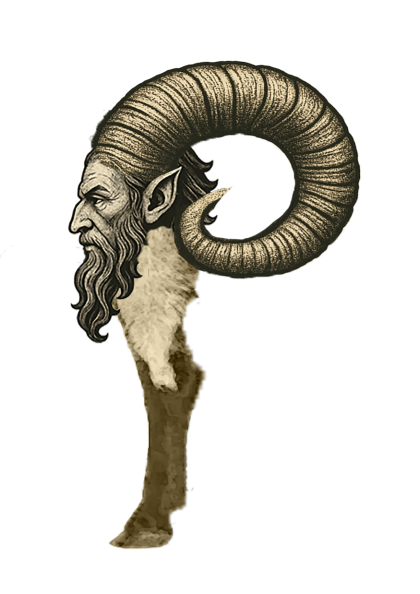

# My Website

I am Izergil,
born Matvey Chakryan,
a seeker of beauty in its fading breath. From the decadence of the 19th century
and the trembling glow of urban night,
I shape visions where phonk’s broken tape
meets the poetry of ruin. My art is a bouquet of shadows—
flowers bruised, yet luminous—
offered to those who hear music
in the depths of melancholy. If you seek a simple image, look elsewhere.
If you seek atmosphere, memory, and darkness made beautiful,
enter the world of Izergil.

Homeworks

- [Character](character.html)
- [Portfolio](https://cz.pinterest.com/matvejchakryan18/)

# Bespoke-character

I completed this bespoke-character on my own.

# Alt text

This mz bespoke charcater in practice.

