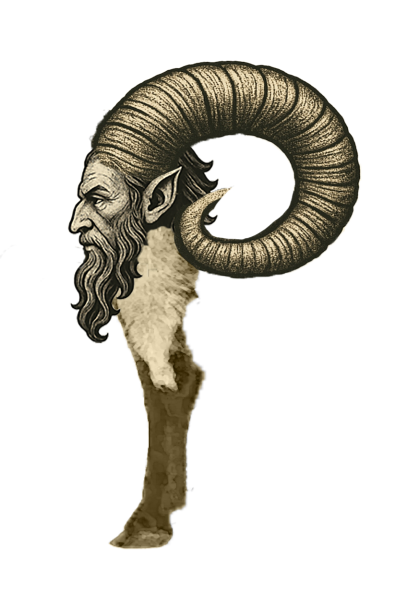
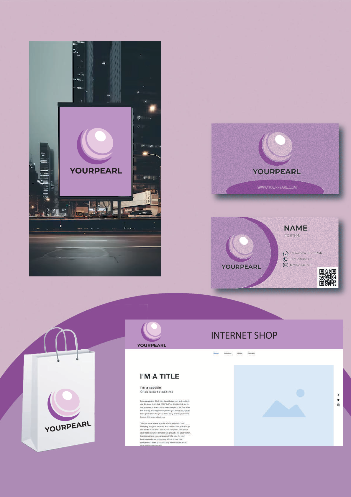

# My Website

I am Izergil,
born Matvey Chakryan,
a seeker of beauty in its fading breath. From the decadence of the 19th century
and the trembling glow of urban night,
I shape visions where phonk’s broken tape
meets the poetry of ruin. My art is a bouquet of shadows—
flowers bruised, yet luminous—
offered to those who hear music
in the depths of melancholy. If you seek a simple image, look elsewhere.
If you seek atmosphere, memory, and darkness made beautiful,
enter the world of Izergil.

Homeworks

- [Self-presentation](https://github.com/matvejchakryan18-ui/my-jekyll-site/blob/main/First%20impression%20(1).pdf)
- [Portfolio](https://cz.pinterest.com/matvejchakryan18/)

# Bespoke-character

I completed this bespoke-character on my own.

# Alt text

This my bespoke charcater in practice.

# Business card

Business card for the fictional brand.

# Portfolio

-ABRAXAS-

The need for a phonk cover brand

My journey to the phonk design world began with branding my personal style. To create something that reflects my inner world, interests and resonate with the community. My previous works were a trial run and study, in which i tested the waters in phonk genre, copying famous drift phonk artists like Kslv and gqtis. Something more consistent and defining was needed.

Space designation

When beginning a piece, it’s always important to understand your connection to the theme, the means of expressing it, and the possible intepretations. However, having a good idea isn‘t enough. I needed to connect concept with a potential audience. The esoteric underground segment of the phonk community values ocultism, obscurity, and nostalgic vhs aesthetics.

Finding form and inspiration

The visual solution was found in my fascination with mythologies, demonology, and creepy internet content. This was significantly influenced by the mystery and mythological channels like «Animal Time» and «The Resurrectionists». Choosing Abraxas, as a Gnostic symbol of cosmic duality, alongside analog distortion, the design merges Memphis-rooted darkness with 19th-century decadent symbolism.	

«In any unclear situation, Experiment!»

It was this quote from Soviet animator Boris Stepantsev that became my design direction «In any unclear situation, experiment!». The chosen tools were attributes of late 19th-century Art Nouveau.  Peacock feathers, androgynous figure, the Cinzel Decorative typeface – all of this is reflected in the visauls and language. The warm patterns of Alphonse Mucha and the cool images of Aubrey Beardsley also played a role.

The Birth of an entity

And finally, we have before us Abraxas himself - the head of the aeons and heavens, the keeper of the world’s time and space. An entity called upon to embody the character of its master and also to integrate into the contemporary lives of phonk fans through vinyl, icons, and vhs entourage.

Reflection on the final result

The main thing this work gave me was an understanding of what personal branding is. What it means to shape certain impression so that society can relate to it. I also learned more about typeface deformations and the principles of layout when working on covers. On the other hand I could work more on shadows and object’s depth. All this allowed to transfer these principles to my future projects.

-FAMUFEST 40-

Point of departure

Famufest is a multi-genre film festival presenting new cinematic voices to a wider audience. Our team approached the 40th edition through the idea of immersion — the moment the viewer is drawn into the image. The project was developed collaboratively (visual identity with Jasmin Linhardtová, Nina Kučerová, Diana Huong Nguyen; web layout by Matvey Chakryan). My focus was the poster as the primary visual entry point.

Tension

The identity needed to remain clear while suggesting a loss of control. It had to communicate information, yet pull the viewer into a cinematic state. The question became how far the image could go without losing readability. At the same time, it had to function across multiple formats.

Visual language

The image formed around the relationship between the screen and the observer. The television symbolizes the film industry, while the figure represents the viewer in transition. I used dark tones, strong contrast, and chrome textures to create a contemporary, hypnotic atmosphere. This language extends across the system, including web layouts by me. The color palette reinforces contrast and tension, while Oswald adds a condensed, cinematic presence that supports the image’s intensity.

Resolution

The final proposal for Famufest 40 spans print and digital applications, built around a single visual idea: drawing the audience into the cinematic world before the film begins. The project wasn’t selected for the final festival identity, but it taught me that a strong concept needs to survive translation across formats and that constraints like budget and production realities are part of the design problem, not outside it.

What i learned

Working on the website helped me understand how visual identity behaves across different mediums. I learned how to balance expressive graphic elements with clarity and usability. Translating the visual language into a digital interface also improved my sense of hierarchy and rhythm in layout. In the future I would explore more interactive elements that could deepen the feeling of immersion.

